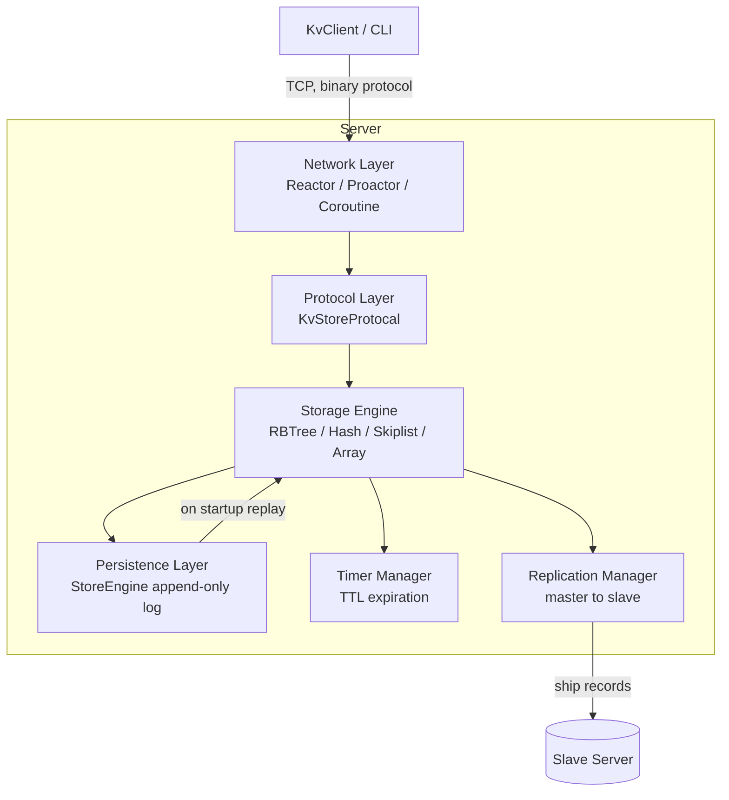

# KVStore

A high-performance, persistent, in-memory key–value store written in modern C++20.

KVStore is a learning-oriented yet feature-complete storage server. It is built around
**pluggable networking models** (Reactor / Proactor / Coroutine), **pluggable storage
engines** (Red-Black Tree / Hash / Skiplist / Array), an **append-only persistence layer**
with crash recovery, **master–slave replication**, **per-key TTL/timeout expiration**, and
an optional **custom memory pool allocator** (tcmalloc-style).

---

## Table of Contents

- [Features](#features)
- [Architecture](#architecture)
- [Repository Layout](#repository-layout)
- [Build](#build)
  - [Prerequisites](#prerequisites)
  - [Build Options](#build-options)
  - [Build Examples](#build-examples)
- [Running the Server](#running-the-server)
  - [Standalone (Master)](#standalone-master)
  - [Master with Replication](#master-with-replication)
  - [Slave / Replica](#slave--replica)
- [Using the Client](#using-the-client)
  - [Interactive CLI](#interactive-cli)
  - [Command Reference](#command-reference)
  - [TTL / Timeout Syntax](#ttl--timeout-syntax)
- [Wire Protocol](#wire-protocol)
- [Persistence Format](#persistence-format)
- [Component Guide](#component-guide)
- [Testing](#testing)
- [License](#license)

---

## Features

- **Multiple network backends**, selected at build time:
  - `REACTOR` — epoll-based, non-blocking, callback-driven event loop.
  - `PROACTOR` — `io_uring`-based asynchronous I/O (requires `liburing`).
  - `COROUTINE` — stackful coroutine server.
- **Pluggable storage engines** behind a common `EngineInterface`:
  - `RBTREE_ENGINE` (default) — ordered Red-Black tree.
  - `HASH_ENGINE` — hash table.
  - `SKIPLIST_ENGINE` — skip list.
  - `ARRAY_ENGINE` — simple array-backed store.
- **Durable persistence** via an append-only write-ahead log with 512 MB file
  rotation and full replay-based crash recovery.
- **Master–slave replication** for read scaling / high availability.
- **Per-key TTL** — `SET`/`MOD` accept an expiration that is scheduled by a timer manager.
- **Batched requests** — multiple operations can be pipelined in a single round trip.
- **Optional custom memory pool** — thread-cache → central-pool → page-allocator design,
  or link against `tcmalloc` / `jemalloc`.
- **Built without C++ exceptions** by default (`-fno-exceptions`) for predictable performance.

---

## Architecture



**Write path:** `request → protocol → engine.set/modify/del → SpinLock → in-memory structure
→ StoreEngine.dump_record (write + flush to disk) → replication enqueue → release lock → respond`.

**Read path:** `request → protocol → engine.get → SpinLock → in-memory lookup → copy value →
respond` (no disk access).

**Recovery path:** `startup → engine.init → StoreEngine.load_record → scan data/kv_*.dt →
replay every record in order with to_disk=false`.

---

## Repository Layout

| Path | Description |
| --- | --- |
| [main.cpp](main.cpp) | Server entry point; arg parsing for master/slave/replication. |
| [CMakeLists.txt](CMakeLists.txt) | Build configuration and feature toggles. |
| [core_engine/](core_engine/) | Storage engines and the abstract `EngineInterface`. |
| [base_component/](base_component/) | Data structures: `rbtree`, `hash`, `skiplist`, `array`. |
| [persistent_core/](persistent_core/) | `StoreEngine` — append-only write-ahead log + recovery. |
| [network/](network/) | Network backends: `reactor/`, `proactor/`, `my_coroutine/`. |
| [protocal/](protocal/) | Wire protocol: headers (`kv_header.h`) and codec (`kv_protocal.hpp`). |
| [replication/](replication/) | `RepManager` — master/slave replication. |
| [timer/](timer/) | Timer manager for TTL / scheduled key expiration. |
| [memory/](memory/) | Custom memory pool allocator (thread cache, central pool, page allocator, slab). |
| [kvstore_client/](kvstore_client/) | `KvClient` library, interactive CLI, and test harness. |

---

## Build

### Prerequisites

- A C++20 compiler (GCC or Clang).
- CMake ≥ 3.16.
- POSIX threads.
- For `PROACTOR` builds: **`liburing`** development headers/library.
- Optional: `tcmalloc` (`gperftools`) or `jemalloc` if linking an external allocator.

### Build Options

All options are passed to CMake with `-D<OPTION>=<VALUE>`.

| Option | Values | Default | Description |
| --- | --- | --- | --- |
| `NETWORK` | `REACTOR`, `PROACTOR`, `COROUTINE` | `REACTOR` | Network backend. |
| `ENGINE` | `RBTREE_ENGINE`, `HASH_ENGINE`, `SKIPLIST_ENGINE`, `ARRAY_ENGINE` | `RBTREE_ENGINE` | Storage engine. |
| `KVSTORE_PORT_NUM` | integer | `20` | Number of consecutive ports to listen on. |
| `KVSTORE_ENABLE_TIMER` | `ON`/`OFF` | `OFF` | Enable connection timing logs. |
| `ENABLE_MEMORY_POOL` | `ON`/`OFF` | `OFF` | Use the built-in memory pool allocator. |
| `ENABLE_TCMALLOC` | `ON`/`OFF` | `OFF` | Link against tcmalloc. |
| `ENABLE_JEMALLOC` | `ON`/`OFF` | `OFF` | Link against jemalloc. |
| `ENABLE_CPP_EXCEPTIONS` | `ON`/`OFF` | `OFF` | Compile with C++ exceptions enabled. |
| `CMAKE_BUILD_TYPE` | `Debug`/`Release` | `Debug` | Standard CMake build type. |

> Note: `ENABLE_TCMALLOC` and `ENABLE_JEMALLOC` are mutually exclusive.

### Build Examples

Default build (Reactor + Red-Black tree engine):

```bash
cmake -S . -B build
cmake --build build
```

Reactor with the built-in memory pool, single listening port:

```bash
cmake -S . -B build -DNETWORK=REACTOR -DKVSTORE_PORT_NUM=1 -DENABLE_MEMORY_POOL=ON
cmake --build build
```

Proactor (`io_uring`) backend with the hash engine:

```bash
cmake -S . -B build -DNETWORK=PROACTOR -DENGINE=HASH_ENGINE
cmake --build build
```

Release build with tcmalloc:

```bash
cmake -S . -B build -DCMAKE_BUILD_TYPE=Release -DENABLE_TCMALLOC=ON
cmake --build build
```

### Build Artifacts

After building, the following executables are produced in `build/`:

- `kvstore` — the server.
- `kvstore_client` — interactive CLI client.
- `kvstore_client_testcase` — client-driven test harness.

---

## Running the Server

The server is configured entirely through an INI file. There are no command-line
settings beyond pointing at that file:

```bash
./build/kvstore /path/to/kvstore.ini            # positional
./build/kvstore --config /path/to/kvstore.ini   # explicit form of the same thing
./build/kvstore                                 # falls back to ./kvstore.ini
```

Persistent data is written to a `data/` directory in the current working directory,
so run each node from its own directory.

### Configuration file

[`kvstore.ini`](kvstore.ini) in the repository root is a documented template.

```ini
[server]
port      = 8050     ; base port; the next KVSTORE_PORT_NUM - 1 ports are also bound
log_level = info     ; error | warn | info | debug

[persistence]
mode = aof           ; aof (append-only log) | rdb (snapshot on SIGUSR1)

[replication]
role        = standalone   ; standalone | master | slave
master_ip   = 10.0.0.4     ; required when role = slave
master_port = 20000        ; the master's RDMA port
```

| Section | Key | Default | Notes |
| --- | --- | --- | --- |
| `server` | `port` | `8050` | Base listening port. |
| `server` | `log_level` | `info` | `error`, `warn`, `info` or `debug`. |
| `persistence` | `mode` | `aof` | `aof` or `rdb`. |
| `replication` | `role` | `standalone` | `standalone`, `master` or `slave`. |
| `replication` | `master_ip` | — | Required when `role = slave`. Must be an address on an RDMA-capable interface. |
| `replication` | `master_port` | `20000` | The master's RDMA port. |

Unknown sections, unknown keys and invalid values are rejected at startup rather than
ignored, so a typo cannot silently start the node in the wrong replication role.

### Roles

- **`standalone`** — serves clients, no replication.
- **`master`** — additionally accepts one replica over RDMA and streams updates to it.
- **`slave`** — connects to `master_ip:master_port` and applies what the master sends.
  A slave also tracks updates locally, so it can be promoted later by restarting it
  with `role = standalone`.

Replication requires an RDMA device, and the eBPF delta tracer needs
`CAP_BPF`, `CAP_PERFMON` and `CAP_SYS_ADMIN` (see
[`scripts/test_master_slave.sh`](scripts/test_master_slave.sh)).

---

## Using the Client

### Interactive CLI

Connect the CLI to a running server:

```bash
./build/kvstore_client <ip> <port>
# e.g.
./build/kvstore_client 127.0.0.1 8050
```

Then type commands, one per line:

```text
SET foo bar
GET foo
MOD foo baz
EXIST foo
DEL foo
```

### Command Reference

| Command | Syntax | Description |
| --- | --- | --- |
| `SET` | `SET <key> <value> [timeout]` | Insert a key. Fails if the key already exists. |
| `GET` | `GET <key>` | Return the value for a key. |
| `MOD` | `MOD <key> <value> [timeout]` | Update an existing key. Fails if the key does not exist. |
| `DEL` | `DEL <key>` | Delete a key. |
| `EXIST` | `EXIST <key>` | Check whether a key exists. |

### TTL / Timeout Syntax

`SET` and `MOD` accept an optional trailing timeout token after the value. When the timeout
elapses, the key is automatically deleted by the timer manager.

Supported units:

| Suffix | Meaning |
| --- | --- |
| `h` | hours |
| `m` | minutes |
| `s` | seconds |
| `ms` | milliseconds |
| `us` | microseconds |

Examples:

```text
SET session abc123 30s
SET cache value 500ms
MOD token xyz 2h
```

---

## Wire Protocol

The protocol is a compact binary framing defined in [protocal/kv_header.h](protocal/kv_header.h).
Requests and responses can be **batched** — a single round trip may carry multiple operations.

**Request framing**

```text
NumHeader            { uint8 tag, uint32 num_request }   // packed, 5 bytes
HeaderInfo[ N ]      { uint32 command, uint32 key_length, uint32 body_length,
                       int sync_idx, TimeoutSpec timeout }
Body[ N ]            key bytes followed by value bytes
```

`tag` is a fixed sentinel (`NUM_HEADER_TAG`, never `'*'`) so the server can tell a
native request from a Redis RESP command by peeking the first byte.

**Commands** (`CommandIdx`):

```text
KVS_START, KVS_SET, KVS_GET, KVS_DEL, KVS_MOD,
KVS_EXIST, KVS_REPR, KVS_RESP, KVS_END, KVS_INVALID
```

`KVS_REPR` / `KVS_RESP` are used by the replication protocol between master and slave.

---

## Persistence Format

The persistence layer ([persistent_core/](persistent_core/)) is an **append-only
write-ahead log**. Records are flushed to disk **before** the server responds to the client,
giving write-ahead durability semantics.

- Storage directory: `data/`
- File naming: `kv_0.dt`, `kv_1.dt`, … (rotated when a file exceeds **512 MB**).
- Record boundary magic: `0x4B565354`.

**Binary record layout**

```text
[ MAGIC : 4 ] [ COMMAND : 2 ] [ KEY_LEN : 8 ] [ KEY ] [ VALUE_LEN : 8 ] [ VALUE ]
COMMAND ∈ { KVS_SET = 1, KVS_DEL = 3, KVS_MOD = 4 }
```

On startup the engine scans `data/`, sorts the files by index, and replays every record in
order (with `to_disk=false` to avoid re-logging), reconstructing the in-memory state. The log
is append-only with no snapshots or compaction.

---

## Component Guide

- **Engine interface** — [core_engine/engine_interface.hpp](core_engine/engine_interface.hpp)
  defines the abstract API: `set`, `get`, `modify`, `del`, `exist`, `init`. All engines are
  thread-safe via an internal `SpinLock`.
- **Red-Black tree** — [base_component/rbtree/rbtree.hpp](base_component/rbtree/rbtree.hpp)
  provides ordered O(log n) operations, with nodes allocated from a slab allocator.
- **Network backends** — [network/reactor/](network/reactor/) (epoll),
  [network/proactor/](network/proactor/) (`io_uring`), and
  [network/my_coroutine/](network/my_coroutine/) (stackful coroutines).
- **Memory pool** — [memory/](memory/) implements a tcmalloc-style allocator:
  `thread_cache` → `central_pool` → `page_allocator`, with a `slab` for fixed-size objects.
  Enabled with `-DENABLE_MEMORY_POOL=ON`.
- **Timer** — [timer/timer.cpp](timer/timer.cpp) schedules TTL-based key deletions.
- **Replication** — [replication/rep_manager.cpp](replication/rep_manager.cpp) ships write
  records from master to slave using a ring buffer.

---

## Testing

A client-driven test harness is built as `kvstore_client_testcase`. Start a server, then run:

```bash
# Terminal 1
./build/kvstore

# Terminal 2
./build/kvstore_client_testcase <ip> <port> <test_mode>
```

### Memory Profiling

The server's memory footprint under different allocators was profiled with
[memory_probe/mem_profile.sh](memory_probe/mem_profile.sh), which samples
`/proc/<pid>/status`. Each run used a **Release** build of the default
`REACTOR` + `RBTREE_ENGINE` server on port 8050 with the `data/` directory
cleared beforehand, driven through the test harness:

- **Peak / full set** — `kvstore_client_testcase <ip> 8050 5` inserts 500 000
  keys, each with a 1 KB value (`testcase_set`).
- **End / after DEL** — `kvstore_client_testcase <ip> 8050 6` deletes all
  500 000 keys (`testcase_del`).

Memory is reported as **virtual** (`VmSize`) and **physical / resident**
(`VmRSS`), sampled just after the server binds (start), after the full set is
loaded (peak), and after every key is deleted (end).

| Allocator | Metric | Start (MB) | Peak / full set (MB) | End / after DEL (MB) |
| --- | --- | --- | --- | --- |
| No pool (glibc `malloc`) | Virtual (`VmSize`) | 94.48 | 653.52 | 653.52 |
| No pool (glibc `malloc`) | Physical (`VmRSS`) | 91.43 | 650.82 | 650.82 |
| Custom pool (`-DENABLE_MEMORY_POOL=ON`) | Virtual (`VmSize`) | 94.51 | 716.23 | 716.23 |
| Custom pool (`-DENABLE_MEMORY_POOL=ON`) | Physical (`VmRSS`) | 91.53 | 713.50 | 713.51 |
| tcmalloc (`-DENABLE_TCMALLOC=ON`) | Virtual (`VmSize`) | 105.21 | 724.21 | 724.21 |
| tcmalloc (`-DENABLE_TCMALLOC=ON`) | Physical (`VmRSS`) | 99.50 | 721.40 | 721.40 |

> After the full working set is deleted, none of the three allocators return the
> freed physical pages to the OS — resident memory stays at its peak. glibc
> `malloc` is the most compact; the custom pool (713 MB) and tcmalloc (721 MB)
> land within ~10% of it. The custom pool uses **sub-octave size classes** — each
> power-of-two octave is split into 8 evenly spaced classes (≤12.5% internal
> fragmentation) — so a 1 KB value takes a 1152 B block instead of the 2048 B a
> pure power-of-two scheme would use (which previously pushed its peak to
> ~1132 MB).

---

## License

See [LICENSE](LICENSE).